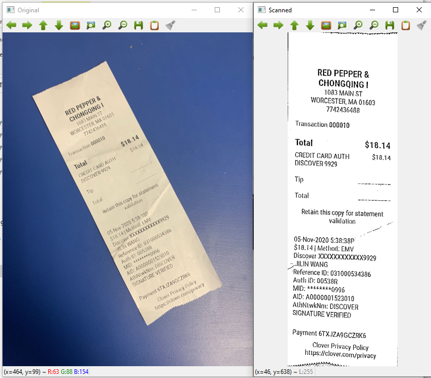

# Document-Scaner

Implement a python and OpenCV based a software that is able to recognized documents or Receipts in a picture, and transform it into a scanned picture. Edge-detections, perspective transform, and thresholding are utilized to find and transform  the object. Help people to scan documents simply with their cell phone's carmera.

